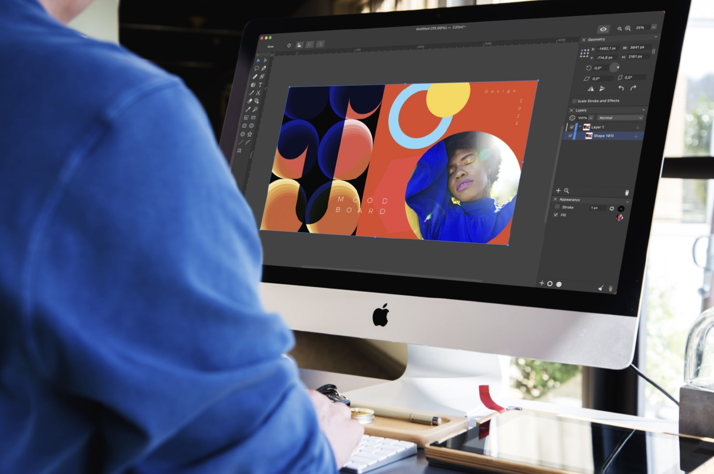

# The Portfolio of Kingsley Watson - Media and 3D Designer 🎨

Welcome! This portfolio is a showcase of my creative journey through graphic design, web, and media. It represents my ongoing growth as a designer who values creativity, clarity, and user-focused visual experiences.

## Table of Contents 📑 
[About](#about) 
[Skills](#skills) 
[Languages](#languages) 
[Features](#features) 
[Installation](#installation) 
[Contact](#contact) 

## About 📘

This portfolio was designed to highlight my growth as a Graphic and Media Designer, combining technical skill with creative direction. Each project showcases a balance between visual appeal and functionality — whether it’s branding, motion graphics, or digital media.

## Skills 💡

Here’s a quick overview of the skills highlighted in this portfolio:

### Languages: 
JavaScript, HTML5, CSS3
### Design Areas:
Brand Identity, Digital Media, Motion Graphics, and Web & UI Design
### Frameworks and Libraries: 
GreenSock
### Tools: 
Git, Figma, Cinema 4D and Adobe Creative Cloud
### Technologies: 
Responsive Design

## Features ⚙️
  Fully Responsive
  Valid HTML5 & CSS3
  GreenSock Animations

## Installation 🧭
To run the portfolio locally:

- Clone this repository
- Navigate into the project directory:
- Open the index.html file in your browser, or if using a local server, start the server and navigate to localhost to view.

## Contact 📫
Feel free to reach out if you’d like to collaborate or have any questions!

Email: [Kingsley Watson](mailto:watsonkingsley38@gmail.com)

Thank you for visiting my portfolio!

